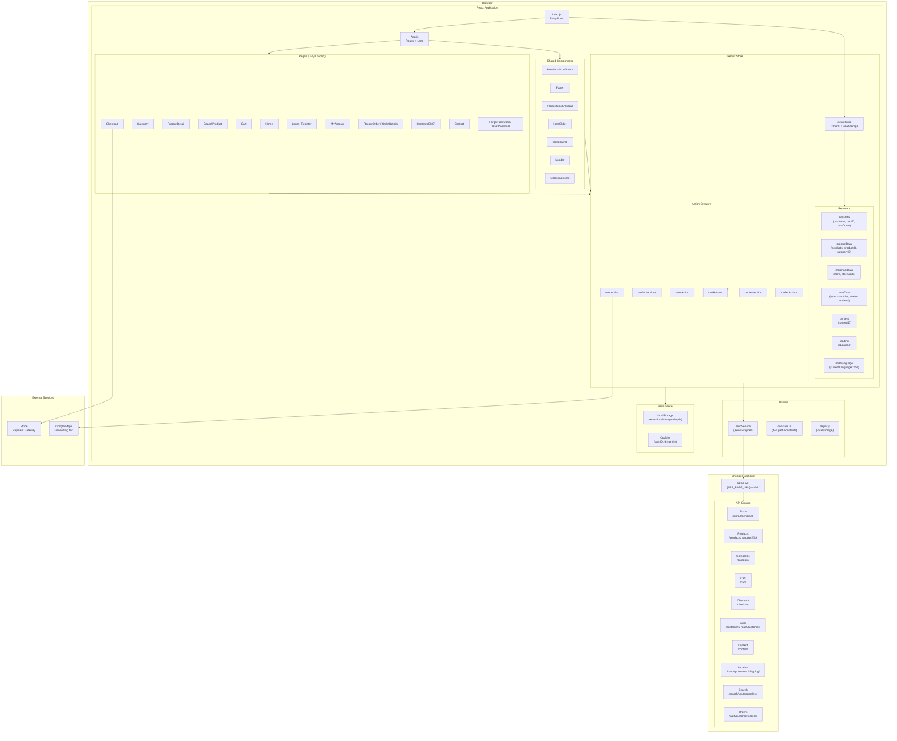
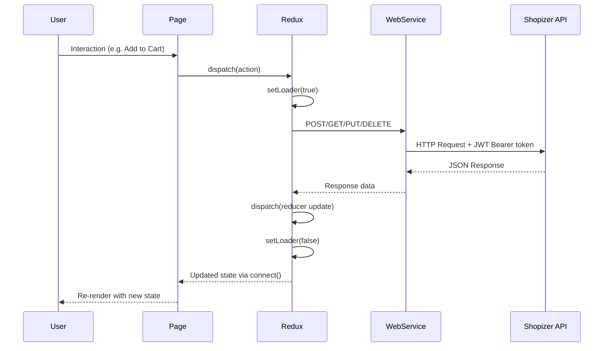
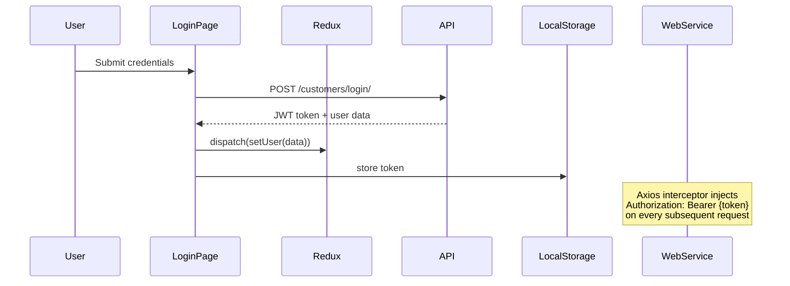
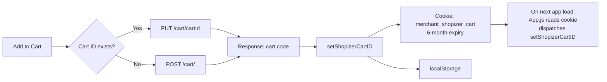
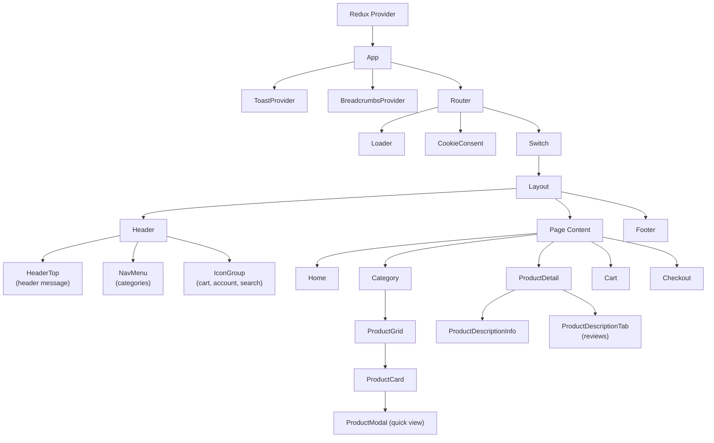
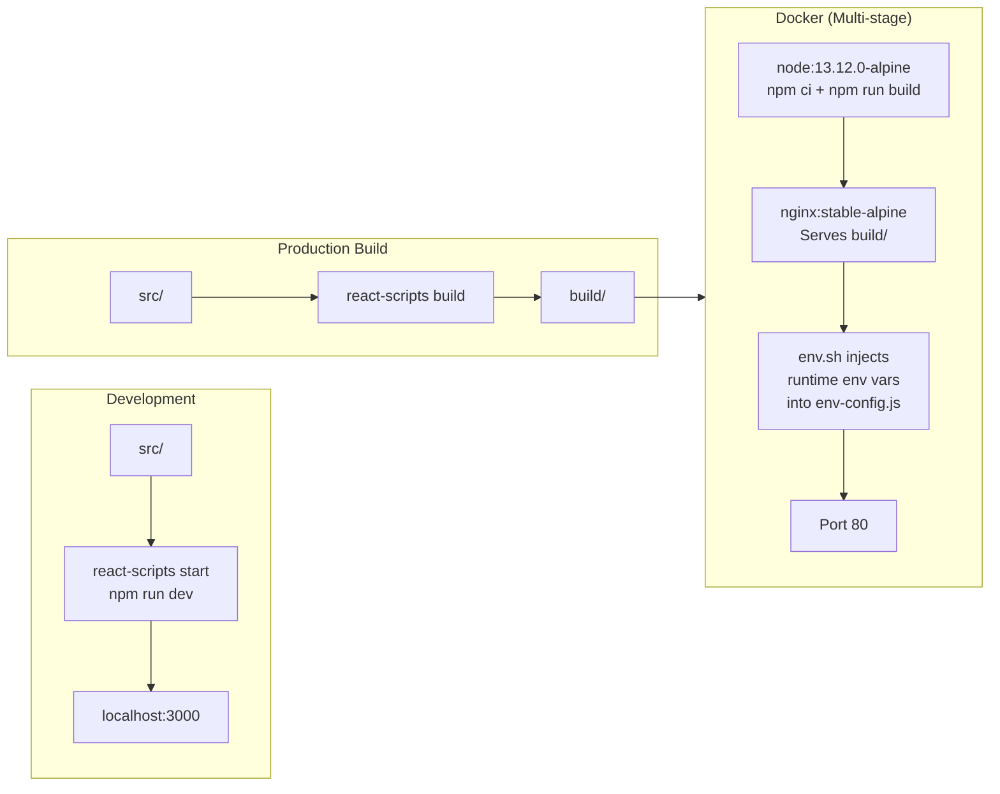

# Shopizer Shop — Architecture Diagram

## High-Level Architecture

---

## Data Flow

---

## Authentication Flow

---

## Cart Persistence Flow

---

## Component Hierarchy

---

## Build & Deployment

