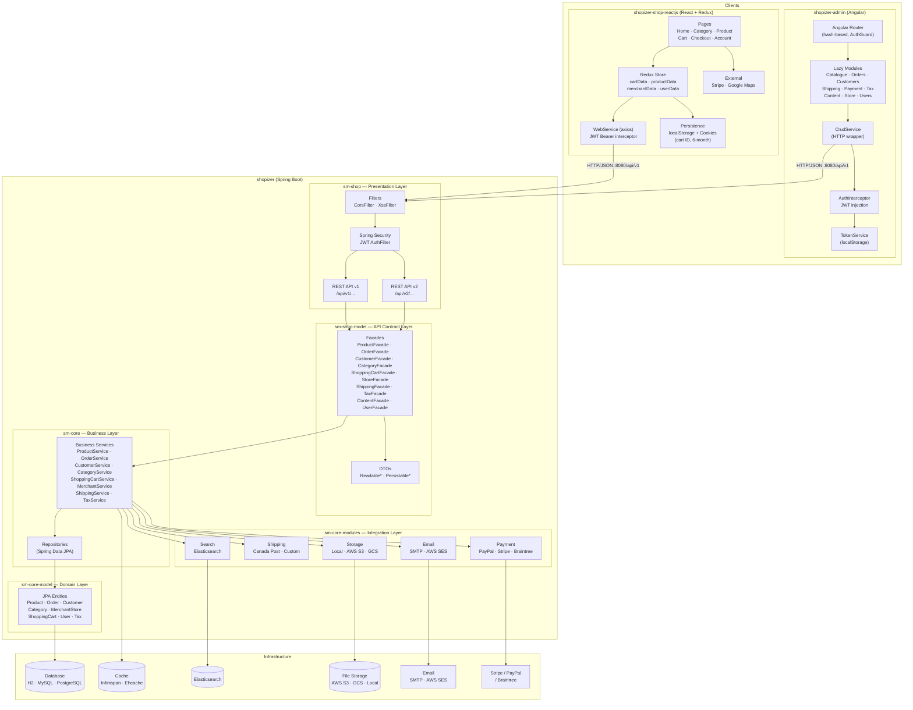
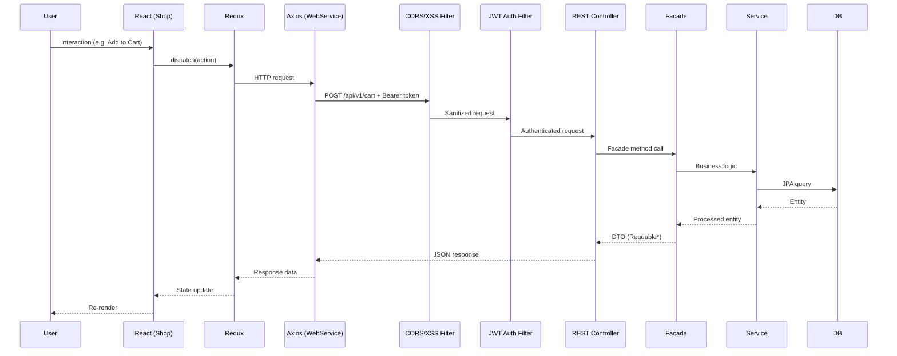
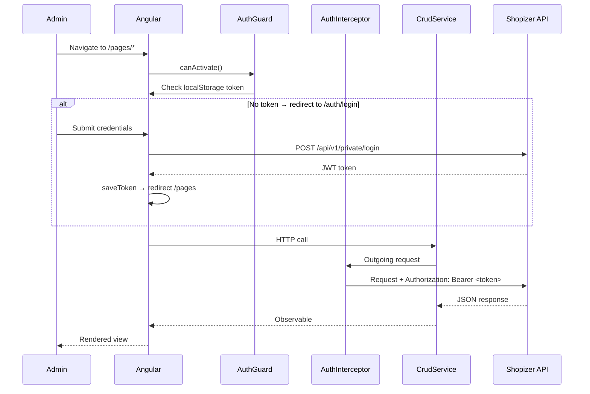
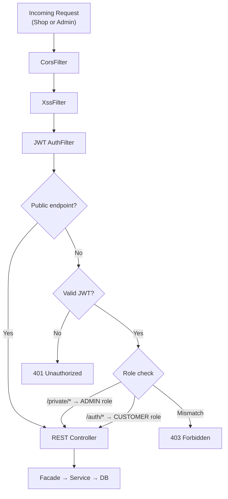
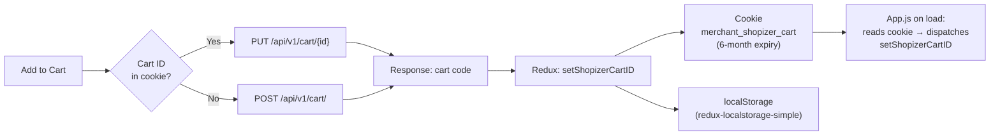
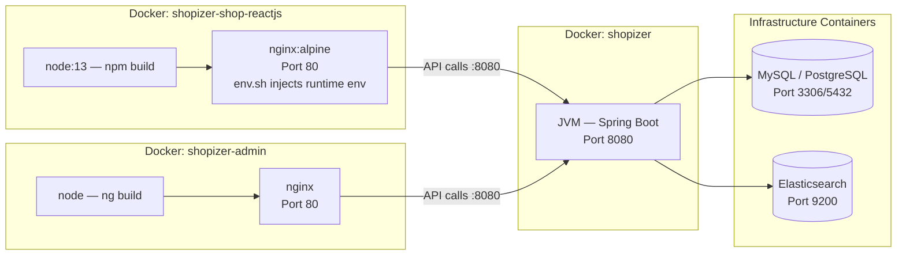
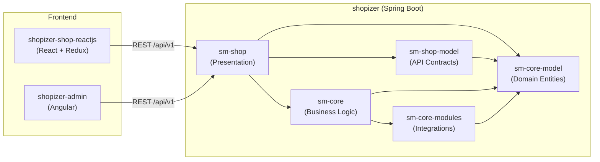

# Shopizer — End-to-End Architecture Diagram

## System Overview

Three repositories make up the full Shopizer platform:

| Repo | Tech | Role |
|------|------|------|
| `shopizer` | Java / Spring Boot | Backend REST API |
| `shopizer-admin` | Angular SPA | Merchant admin panel |
| `shopizer-shop-reactjs` | React SPA | Customer-facing storefront |

---

## End-to-End Architecture

---

## Request Lifecycle (Customer Storefront)

---

## Request Lifecycle (Admin Panel)

---

## Authentication & Security

---

## Cart Persistence (Storefront)

---

## Deployment Topology

---

## Module Dependency Summary

